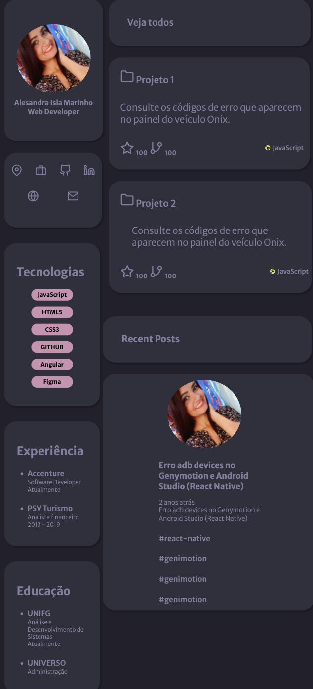
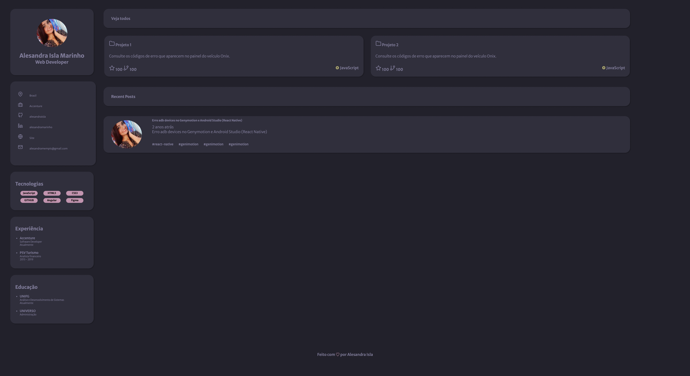

# portifolio-rocketseat

Desafio proposto no final do curso Discover da Rocketseat.

## Tecnologias ##

HTML - Utilizei tags do HTML5.
CSS - O layout foi construído utilizando GRID Layout. E alguns componentes foi utilizado FLEX. Modelo responsivo.

## Link para visualização ##

[Portifólio](https://alesandraisla.github.io/portifolio-rocketseat/).

## Layout Mobile e Desktop ##

     
    

